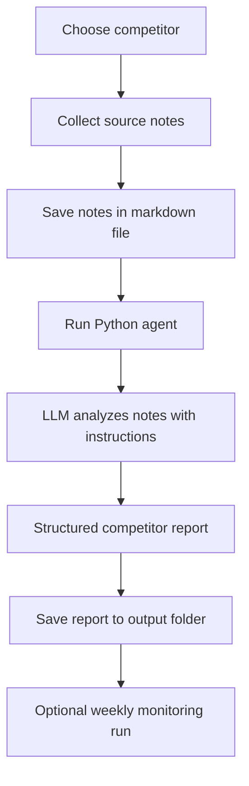

# Competitive Intelligence Agent for Colleague AI
A beginner-friendly starter kit for the **Colleague AI Competitive Intelligence Agent** project.

## 1) What this project is asking you to build
You are building an **AI agent** that acts like a junior product marketer / strategy analyst for the K–12 AI market.

Its job is to:
- track competitors,
- summarize what changed,
- compare each competitor to Colleague AI,
- rate the threat level,
- suggest what Colleague AI should do next,
- and produce a clean report.

Your 3 target competitors are:
1. MagicSchool
2. SchoolAI
3. Brisk Teaching

---

## 2) What an "agent" means here
For this assignment, an agent does **4 simple things**:

1. **Collect information**  
   Example: website copy, pricing pages, blog updates, press releases, case studies, jobs.

2. **Analyze information**  
   Example: “This company is aimed mostly at teachers, not district leaders.”

3. **Decide what matters**  
   Example: “This is a medium threat because it is strong in teacher workflows but weak in district visibility.”

4. **Output a useful result**  
   Example: a competitor report, weekly alert, or threat summary.

You do **not** need to build a super-advanced autonomous system.  
A simple workflow that takes source text and produces structured analysis is enough.

---

## 3) Easiest project option to choose
### Recommended easy option
Use a **simple Python + OpenAI workflow**.

Why this is the easiest:
- very small amount of code,
- easy to explain in class/interview,
- easy to change later,
- still counts as a working agent,
- lets you show the prompt, workflow, and report clearly.

### How this starter kit works
You collect notes for one competitor and save them in a text/markdown file.
Then the Python script:
- reads the notes,
- sends them to the model with strong instructions,
- asks for a structured report,
- saves the final competitor report as markdown.

That is a valid beginner-friendly agent.

---

## 4) Easy data-source choices
The assignment says: **“You will need to decide what data you want to give to your agent.”**

That sounds open-ended, but you do not need to scrape everything on the internet.

### Best beginner choice: use only 4 source types
Choose these:
1. Official website homepage / product pages
2. Pricing page
3. Blog / newsroom / press page
4. One recent customer story, case study, or FAQ page

Why this is the best choice:
- official sources are easy to defend,
- less messy than scraping social media,
- enough information to answer almost every required section,
- easier to keep the project clean.

### Optional “level up” sources
Only add these if you want to improve the project later:
- careers / job postings,
- founder LinkedIn,
- conference / webinar pages,
- recent news coverage,
- district rollout announcements.

### What I would choose if I were doing this assignment
Use this exact input set for each competitor:
- homepage / main product page,
- district or admin page,
- pricing page,
- recent update or press release,
- one blog or FAQ page.

That is enough.

---

## 5) What each report should answer
For each competitor, your agent should produce these sections:

### A. Competitor Snapshot
- What do they sell?
- Who is the buyer?
- What school job are they helping with?

### B. Positioning Analysis
- What is their main promise?
- Who is the messaging aimed at?
- Are they focused on:
  - teacher productivity,
  - personalization,
  - student support,
  - governance,
  - admin efficiency,
  - curriculum alignment?

### C. Comparison to Colleague AI
Compare against Colleague AI on:
- teacher support,
- district/admin tools,
- curriculum alignment,
- document/knowledge management,
- dashboards/leadership visibility,
- breadth of capabilities.

### D. Strategic Threat Assessment
Label:
- Low threat
- Medium threat
- High threat

And explain why.

### E. Recent Updates
Look for:
- product launches,
- new features,
- pricing changes,
- case studies,
- events,
- partnerships,
- funding,
- hiring signals,
- legal or PR issues.

### F. Predicted Next Move
Based on the evidence, predict:
- what the competitor is likely to do next,
- and what Colleague AI should do in response.

---

## 6) Beginner-friendly project architecture
## Workflow diagram

### Simple explanation of the workflow
- **Input** = competitor notes you gathered
- **Brain** = the agent prompt/instructions
- **Engine** = the LLM call
- **Output** = the final competitor report

---

## 7) Files in this starter kit
- `README.md` → this guide
- `QUICK_START.md` → 10-minute setup
- `agent_prompt.txt` → the main prompt for the agent
- `simple_ci_agent.py` → working Python script
- `requirements.txt` → packages to install
- `.env.example` → environment variable example
- `templates/source_notes_template.md` → source collection template
- `sample_magic_school_notes.md` → example notes input
- `sample_magicschool_report.md` → example completed report
- `workflow_diagram.md` → diagram you can submit or copy into slides

---

## 8) Why this counts as a real agent
This project counts as an agent because it:
- receives a task,
- gathers/accepts information,
- applies reasoning,
- produces a recommendation-oriented output.

Even though this is simple, it is still goal-driven and task-oriented.

---

## 9) Easy implementation path
### Option 1 — easiest and recommended
**Manual collection + AI analysis**
- You gather notes manually from official sites.
- Save them in markdown.
- Run the script.
- The script generates the report.

This is the easiest option and safest for beginners.

### Option 2 — medium difficulty
**Manual collection + weekly rerun**
- Same as Option 1,
- but run it once per week,
- compare new notes with old notes,
- generate alerts.

### Option 3 — harder
**Auto-fetch from websites / feeds**
- Add scraping or RSS/news APIs.
- Use automation to monitor updates.
- Better project, but not necessary for a first pass.

---

## 10) How to present this project in simple words
### What did you build?
I built a competitive intelligence agent for Colleague AI that analyzes K–12 AI competitors and generates structured reports with threat assessment and strategy recommendations.

### How does it work?
It takes competitor source notes, sends them to an LLM with detailed instructions, and returns a report covering positioning, comparison to Colleague AI, recent updates, and strategic response.

### Why did you choose this design?
I chose a simple workflow so the system is easy to explain, easy to maintain, and strong enough to produce useful competitor analysis without complex infrastructure.

---

## 11) Good beginner answer for “what data did you choose?”
You can say:

> I used a focused set of public sources for each competitor: the official product website, pricing page, district/admin pages, recent blog or press updates, and one supporting page such as a FAQ or case study. I chose these because they are reliable, easy to verify, and contain enough information to analyze positioning, product scope, buyer audience, and recent moves.

---

## 12) Suggested submission strategy
For your deliverable, submit:
1. the working Python agent,
2. the agent prompt,
3. the workflow diagram,
4. one completed report (already included as a sample),
5. and optionally mention how you would extend it into weekly monitoring.

---

## 13) Nice upgrade ideas if you have extra time
- Add a JSON output mode
- Add alert scoring for “important changes”
- Save reports in both markdown and PDF
- Compare this week vs last week
- Add a simple Streamlit UI
- Add competitor scoring (1 to 5) by category

---

## 14) Final recommendation
For this assignment, start with:
- **MagicSchool first**
- official sources only
- one clear prompt
- one clean report

After that, repeat the same process for SchoolAI and Brisk Teaching.

That gives you a complete, realistic, and easy-to-explain project.
