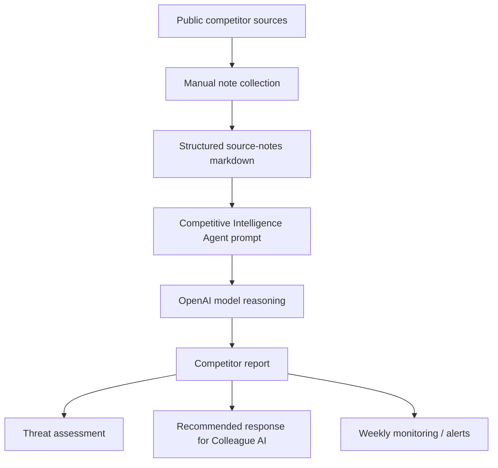

# Workflow Diagram

```mermaid
flowchart TD
    A[Public competitor sources] --> B[Manual note collection]
    B --> C[Structured source-notes markdown]
    C --> D[Competitive Intelligence Agent prompt]
    D --> E[OpenAI model reasoning]
    E --> F[Competitor report]
    F --> G[Threat assessment]
    F --> H[Recommended response for Colleague AI]
    F --> I[Weekly monitoring / alerts]
```
